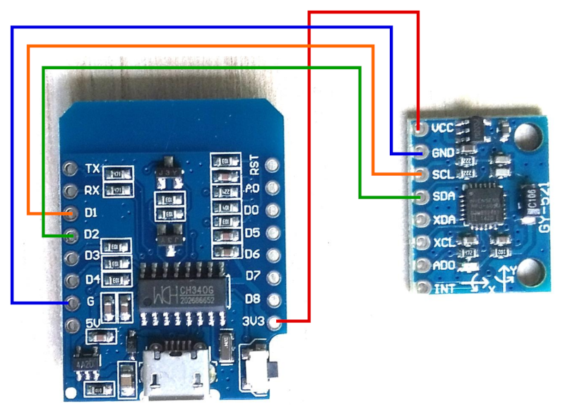

# headtracker
Arduino based head tracker for OVBOX and TASCAR, using an ESP8266 microcontroller and a GY-521 (MPU6050 based) motion processor board.

## Wiring

Connect these pins of the ESP8266 / ESP32 board with the motion sensor board GY-521:

| ESP board | motion sensor |
|-----------|---------------|
| G         | GND           |
| 3V3       | VCC           |
| D1        | SCL           |
| D2        | SDA           |

Please note that according to the I2C specifications the cables should not be longer than 25 cm. We tested wires of up to 1 m length without problems.

## Arduino files

Use [oscheadtracker](oscheadtracker/oscheadtracker.ino) for OSC support, or [usbserheadtracker](usbserheadtracker/usbserheadtracker.ino) for USB serial support.
